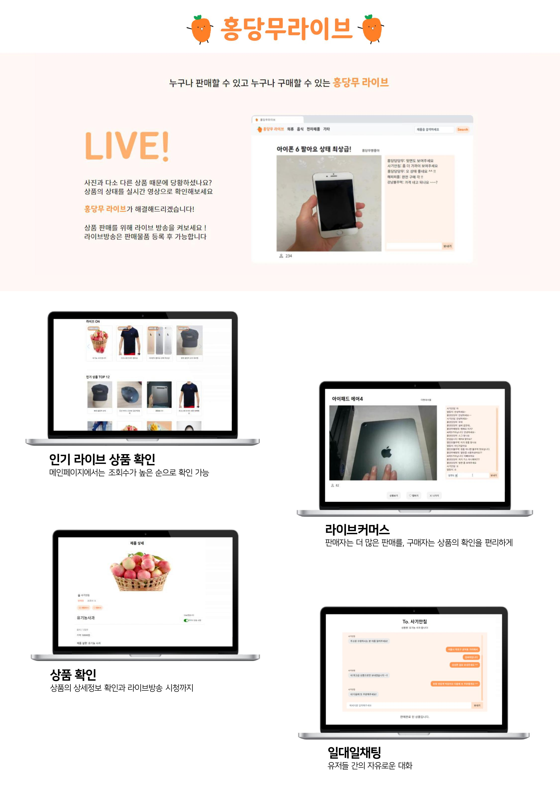
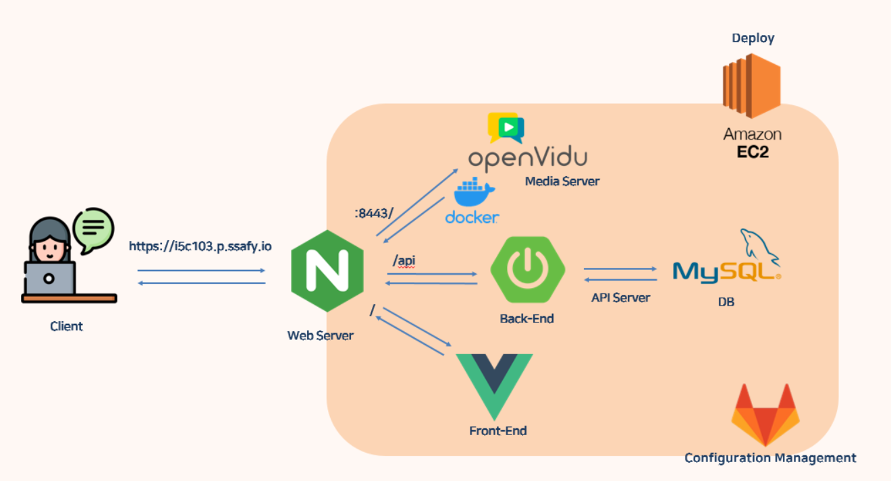

<br>

# 🧡 홍당무 라이브 🧡

누구나 판매할 수 있고 누구나 구매할 수 있는 중고 상품과 소상공인을 위한 라이브 커머스 프로젝트입니다. 
🤗👉[홍당무라이브](https://i5c103.p.ssafy.io/)

<br>

### 홍당무 라이브를 개발한 서울광주롱디팀을 소개합니다 !

- 김용재 😤
  - Vue의 달인이 되고싶은 나

- 김창규😁
  - 코딩 하지마... / 그게 뭔데? / 코딩 하지말라고... / 알겠어

- 이연지 😎
  - 사용자 만족감을 최상으로하는 완성도 있는 서비스 구현을 목표로 합니다 !
  
- 최성은 🤩
  - 마감기한을 잘 지키는 사람이 되겠습니다
  

<br>



<br>

---

## 🚀 서비스 아키텍처



<br>

## :video_game: 기술 스택

### 💻Back-End

  <details>
      <summary>Back 자세히 살펴보기 🔥</summary>
      <ul>
        <li>기술스택 ⚙</li>
      </ul>
      <ul>
          <li>Spring-Boot : 2.3.9</li>
          <li>Spring Security</li>
          <li>spring-boot-starter-web</li>
          <li>spring-boot-starter-websocket</li>
          <li>spring-boot-starter-freemarker</li>
          <li>spring-boot-starter-data-jpa</li>
          <li>spring-boot-starter-jdbc</li>
          <li>spring-boot-starter-actuator</li>
          <li>modelmapper : 2.3.8</li>
          <li>jjwt : 0.9.1</li>
          <li>lombok</li>
          <li>mysql : 8.0.24</li>
      </ul>
  </details>

### ✨Front-End

<details>
    <summary>Front 자세히 살펴보기 🌈</summary>
    <ul>
        <li>기술스택 ⚙</li>
    </ul>   
    <ul>
        <li>JS, HTML, CSS</li>
        <li>Vue.js @2.6.14</li>
    </ul>
    <li>--------------------------------------------------------------------------------------</li>
     <ul>
        <li>라이브러리 📚</li>
    </ul>   
    <ul>
        <li>axios @0.21.1 : Promise 기반 HTTP 클라이언트</li>
        <li>bootstrap @5.0.2 : 전체적인 디자인</li>
        <li>bootstrap-vue @2.21.2</li>
        <li>core-js @3.6.5</li>
        <li>openvidu-browser @2.19.0 : 실시간 라이브 방송</li>
        <li>sockjs-client @1.5.1 : 실시간 채팅</li>
        <li>sweetalert @2.1.2 : alert 커스텀</li>
        <li>swiper @6.8.1 : 캐로우셀 구현</li>
        <li>webstomp-client @1.2.6 : 1대1 채팅</li>
    </ul>
</details>

### 🌏Infra

  <details>
      <summary>개발, 자세히 살펴보기 🔥</summary>
      <ul>
          <li>AWS EC2 - Deploy Server</li>
          <li>GitLab</li>
          <li>Docker</li>
      </ul>
  </details>
<br>

-------------------------------------------------


## ⚙️ Install and Usage

#### 시스템 환경

<details>
<summary>홍당무라이브는 아래와 같은 환경에서 실행 중입니다.</summary>
      <ul>
          <li>OS : Linux version 5.8.0-1041-aws (buildd@lgw01-amd64-035) (gcc (Ubuntu 9.3.0-17ubuntu1~20.04) 9.3.0, GNU ld (GNU Binutils for Ubuntu) 2.34) #43~20.04.1-Ubuntu SMP Thu Jul 15 11:07:29 UTC 2021</li>
          <li>Cpu 모델 : Intel(R) Xeon(R) CPU E5-2686 v4 @ 2.30GHz</li>
          <li>Total Memory: 16395128 kB</li>
          <li>물리 cpu 개수 : 4,	cpu당 물리 코어 : 4,	논리 코어 수 : 32</li>
      </ul>
</details>


#### 시스템 구성

<details>
<summary>상세보기</summary>
      <ul>
          <li>DB 서버 : mysql  Ver 8.0.26-0ubuntu0.20.04.2 for Linux on x86_64 ((Ubuntu))</li>
          <li>파일 서버 : 프로젝트 backend/images 폴더</li>
          <li>WebRTC : openvidu-server:2.19.0</li>
      </ul>
</details>


#### HTTPS 키 발급
<details>
frontend에서는 ssl이 적용되어 있기 때문에 HTTPS 인증을 받아야합니다.

```bash
sudo apt-get install letsencrypt
# 만약 nginx를 사용중이면 중지
sudo systemctl stop nginx
# 인증서 발급
sudo letsencrypt certonly --standalone -d www제외한 도메인 이름
# 이메일 쓰고 Agree
# 뉴스레터 no
# 키가 발급되는데 이 두 가지를 써야합니다. 밑의 경로에 각각 하나씩 있습니다.
 ssl_certificate /etc/letsencrypt/live/도메인이름/fullchain.pem; 
 ssl_certificate_key /etc/letsencrypt/live/도메인이름/privkey.pem; 
```
</details>

<br>

---


##   :open_file_folder: 개발 스프린트

|스프린트✌ | 기간📚 | FE🌈   | BE🤖   |
| :----: | :------: | -------- | ---- |
| 프로젝트 구상 및 착수 **(v0.0.1)** | 2021.07.05<br /> ~ <br />2021.07.09 | - 프로젝트 아이디어 도출<br />- 와이어 프레임 작성<br />- 개발환경 구축<br/>- 컴포넌트 구조 형성<br/> | - Database ERD 작업 진행<br />- REST API 문서 작성<br />- 개발환경 구축<br /> |
| 프로젝트 기본 기능 개발<br /> **(v1.0.0)** |  2021.07.12<br />~<br />2021.07.16  | **김용재**<br/>- 사용자는 물건을 판매하기 위해 상품 정보를 등록할 수 있습니다 [#S05P12C103-68](https://meeting.ssafy.com/s05p11c101/channels/13#)<br/>- 파일 업로드/다운로드 백엔드 기능 개발 [#S05P12C103-73](https://meeting.ssafy.com/s05p11c101/channels/13#)<br/>- 상품관리 컨트롤러 구현 [#S05P12C103-69](https://meeting.ssafy.com/s05p11c101/channels/13#)<br/>- 제품 등록페이지 기본 양식 완성 [#S05P12C103-21](https://jira.ssafy.com/browse/S05P12C103-21)<br/><br/><br/> **김창규**<br/>- 제품 등록페이지 등록 구현 [#S05P12C103-78](https://jira.ssafy.com/browse/S05P12C103-78)<br/>- 제품 등록페이지 토큰 값 보내 요청 [#S05P12C103-82](https://jira.ssafy.com/browse/S05P12C103-82)<br/>- 마이페이지 response구현 [#S05P12C103-86](https://meeting.ssafy.com/s05p11c101/channels/13#)<br/>- 로그인 프로세스 진행 [#S05P12C103-67](https://meeting.ssafy.com/s05p11c101/channels/13#)<br/><br/><br/> **이연지**<br />- 메인페이지 상품리스트 데이터 바인딩 [#S05P12C103-72](https://jira.ssafy.com/browse/S05P12C103-72)<br />- 메인페이지 상품리스트 화면 구성 [#S05P12C103-87](https://jira.ssafy.com/browse/S05P12C103-87)<br/>- 방송만들기 페이지 비동기 동작 구현, 데이터 바인딩 [#S05P12C103-75](https://jira.ssafy.com/browse/S05P12C103-75)<br/>- 방송만들기 페이지 서버와 request&response [#S05P12C103-84](https://jira.ssafy.com/browse/S05P12C103-84)<br/>- 방송 만들기 화면 구성 [#S05P12C103-66](https://jira.ssafy.com/browse/S05P12C103-66)<br/>- 라이브방송 판매자용 화면 구성 [#S05P12C103-71](https://jira.ssafy.com/browse/S05P12C103-71)<br/>- 프로젝트 공통 폰트/컬러/폼, 버튼, router-link 디자인 적용 [#S05P12C103-85](https://jira.ssafy.com/browse/S05P12C103-85)<br/> | **공통**<br />- 기능명세서 작성<br /><br/><br/><br/><br/>**최성은** <br/>- 사용자가 서비스를 이용하기 위해 데이터를 저장하는 DB를 설정한다  마이페이지 response구현 #S05P12C103-86 로그인 프로세스 진행<br/> |
| 프로젝트 심화 기능 개발<br />**(v1.1.0)** |  2021.07.19<br />~<br />2021.07.30  | **김용재**<br/>- 회원가입 유효성 검사 [S05P13C103-34](https://jira.ssafy.com/browse/S05P13C103-34)<br/>- 상품정보 store 관리 [S05P13C103-30](https://jira.ssafy.com/browse/S05P13C103-30)0<br/>- 유저 닉네임 store 관리 [S05P13C103-24](https://jira.ssafy.com/browse/S05P13C103-24)<br/>- 상품 상세페이지의 상품 이미지를 케로젤로 띄움 [#S05P13C103-53](https://jira.ssafy.com/browse/S05P13C103-53)<br/>- 상품 등록페이지의 사진 업로드 [#S05P13C103-51](https://jira.ssafy.com/browse/S05P13C103-51)<br/>- 상품 등록페이지의 상세 내용 입력 [#S05P13C103-52](https://jira.ssafy.com/browse/S05P13C103-52)<br/>- 메인 페이지의 이미지 리스트 띄우기 [#S05P13C103-47](https://jira.ssafy.com/browse/S05P13C103-47)<br/>- 로그인 폼 디자인 및 기능  [#S05P13C103-40](https://jira.ssafy.com/browse/S05P13C103-40)<br/>- 회원가입 폼 디자인 및 기능  [#S05P13C103-42](https://jira.ssafy.com/browse/S05P13C103-42)<br/><br/><br/> **김창규**<br/>- webRTC 구현하기-kurento(node.js) 튜토리얼 실행하기 [S05P13C103-46](https://jira.ssafy.com/browse/S05P13C103-46)<br/>- webRTC 구현하기-openvidu 튜토리얼 실행하기 [S05P13C103-37](https://jira.ssafy.com/browse/S05P13C103-37)<br/><br/><br/> **이연지**<br/>- websocket을 활용한 실시간 채팅 구현 [#S05P13C103-17](https://jira.ssafy.com/browse/S05P13C103-17)<br/>- 실시간 채팅 유저 닉네임 연동 [#S05P13C103-25](https://jira.ssafy.com/browse/S05P13C103-25)<br />- 유저 아이디, 닉네임 localStorage와 store에서 관리 [#S05P13C103-24](https://jira.ssafy.com/browse/S05P13C103-24)<br/>- 라이브방송 페이지 판매자와 구매자 화면 구분 [#S05P13C103-27](https://jira.ssafy.com/browse/S05P13C103-27)<br/>- 상품정보 store에서 관리 [#S05P13C103-30](https://jira.ssafy.com/browse/S05P13C103-30)<br/>- 회원가입 유효성 검사 [#S05P13C103-34](https://jira.ssafy.com/browse/S05P13C103-34)<br/>- 라이브방송 페이지 디자인 [#S05P13C103-43](https://jira.ssafy.com/browse/S05P13C103-43)<br/>- 카테고리 페이지 구현 [#S05P13C103-54](https://jira.ssafy.com/browse/S05P13C103-54)<br/>- 채팅방 별로 세션 다르게 구성하여 개별 채팅방 구현(localStorage에 실시간 채팅 websocket 세션 정보 저장, 세션 정보로 채팅방 mapping [#S05P13C103-58](https://jira.ssafy.com/browse/S05P13C103-58)<br/> | **최성은**<br/>- 마이페이지 상품목록 반환 수정 [#S05P13C103-41] <br/>- 메인페이지 response_image [#S05P13C103-32] <br/>- 백엔드 배포 [#S05P13C103-29] <br/>- 아마존 db연동 [#S05P13C103-26] <br/>- 상품상세보기 response변경 [#S05P13C103-23] <br/>- 로그인시 닉네임도 반환 [#S05P13C103-22] <br/>- 상품정보조회 수정 [#S05P13C103-21] <br/>- 실시간 채팅 웹소켓 백엔드 테스트 [#S05P13C103-19] |
| 프로젝트 핵심 기능 개발<br />**(v1.2.0)** |  2021.08.02<br />~<br />2021.08.20  | **김용재**<br/>- 상품 상세 이미지 캐로우셀 수정 [#S05P13C103-53](https://jira.ssafy.com/browse/S05P13C103-53)<br/>- 카레고리 별 라이브리스트, 상품리스트 구현 완료 [#S05P13C103-54](https://jira.ssafy.com/browse/S05P13C103-54)<br/>- modal 수정 [#S05P13C103-68](https://jira.ssafy.com/browse/S05P13C103-68)<br/>- 상품 상세 페이지에서 판매중/판매완료 표기 [#S05P13C103-75](https://jira.ssafy.com/browse/S05P13C103-75)<br/>- 찜하기 기능 구현 완료 [#S05P13C103-85](https://jira.ssafy.com/browse/S05P13C103-85)<br/>- 검색 기능 구현 완료 [#S05P13C103-86](https://jira.ssafy.com/browse/S05P13C103-86)<br/><br/><br/>**이연지**<br/>- 메인페이지 서비스 소개 배너 디자인 [#S05P13C103-108](https://jira.ssafy.com/browse/S05P13C103-108)<br />- webRTC 라이브 방송에서 판매자 화면만 보이도록 구현 [#S05P13C103-65](https://jira.ssafy.com/browse/S05P13C103-65)<br />- 라이브방송 페이지 접속 시 방송 시작하도록 openvidu 세션 구성 [#S05P13C103-70](https://jira.ssafy.com/browse/S05P13C103-70)<br/>- 라이브 방송종료 구현<br/>- 라이브 방송 종료시 종료안내창 띄우기 [#S05P13C103-69](https://jira.ssafy.com/browse/S05P13C103-69)<br />- 라이브방송 조회수 카운팅 [#S05P13C103-109](https://jira.ssafy.com/browse/S05P13C103-109)<br/>- 채팅창 자동 스크롤 구현 [#S05P13C103-91](https://jira.ssafy.com/browse/S05P13C103-91)<br/>- 일대일채팅 이전 대화내역 출력 [#S05P13C103-88](https://jira.ssafy.com/browse/S05P13C103-88)<br/>- 일대일채팅 유저 닉네임 query 처리하여 새로고침 시에도 데이터 유지 [#S05P13C103-87](https://jira.ssafy.com/browse/S05P13C103-87)<br/>- 존재하지 않는 라이브방송 url 접속시 안내창 띄우기, 존재하는 라이브 주소로만 접속 가능하도록 구성 [#S05P13C103-98](https://jira.ssafy.com/browse/S05P13C103-98)<br/>- 스크롤바 디자인 [#S05P13C103-96](https://jira.ssafy.com/browse/S05P13C103-96)<br/>- footer, 방송만들기, 방송시청페이지 디자인, 비디오 해상도 조절 [#S05P13C103-92](https://jira.ssafy.com/browse/S05P13C103-92)<br/>- 일대일채팅 url 변경, 로그인 시에만 이용가능하도록 구성, websocket을 활용한 실시간 채팅 구현, 채팅창 디자인 [#S05P13C103-74](https://jira.ssafy.com/browse/S05P13C103-74)<br/>- openvidu 콘솔창 메세지 안보이기 [#S05P13C103-110](https://jira.ssafy.com/browse/S05P13C103-110)<br/>- 메인,카테고리 페이지 상품 목록 디자인 수정(반응형, 정렬, 세부디자인) [#S05P13C103-111](https://jira.ssafy.com/browse/S05P13C103-111)<br/>- 메인,카테고리 페이지 라이브 목록 디자인 수정(반응형, 이미지 늘어지는 문제, CSS) [#S05P13C103-112](https://jira.ssafy.com/browse/S05P13C103-112)<br/>- 마이페이지, 프로필페이지 디자인 수정 [#S05P13C103-113](https://jira.ssafy.com/browse/S05P13C103-113)<br/>- 모달 컴포넌트 재사용할 수 있도록 수정 [#S05P13C103-68](https://jira.ssafy.com/browse/S05P13C103-68)<br />- 비로그인 상태에서 라이브방송 시청 에러 해결(유저 아이디값이 없을 경우 빈값보내는 걸로 변경) [#S05P13C103-118](https://jira.ssafy.com/browse/S05P13C103-118)<br/>- 검색 에러 해결(검색 url, params 변경) [#S05P13C103-119](https://jira.ssafy.com/browse/S05P13C103-119)<br/>- 상품상세페이지에서 채팅시작시 상품명 바인딩 에러 해결 [#S05P13C103-120](https://jira.ssafy.com/browse/S05P13C103-120)<br/>- Frontend 배포 [#S05P13C103-107](https://jira.ssafy.com/browse/S05P13C103-107)<br/> | **최성은**<br/>- DB 초기화: 웹페이지에서 구현된 기능으로 더미데이터 입력 [#S05P13C103-47](https://jira.ssafy.com/browse/S05P13C103-47)<br/>- ERD 테이블에 맞게 코드 수정 [#S05P13C103-79](https://jira.ssafy.com/browse/S05P13C103-79)<br/>- 일대일 채팅 Stomp 구현  [#S05P13C103-55](https://jira.ssafy.com/browse/S05P13C103-55)<br/>- 1대1 채팅에서 판매 완료 구현 [#S05P13C103-63](https://jira.ssafy.com/browse/S05P13C103-63)<br/>- 검색기능 구현 [#S05P13C103-60](https://jira.ssafy.com/browse/S05P13C103-60)<br/>- 메인페이지에 라이브리스트 [#S05P13C103-61](https://jira.ssafy.com/browse/S05P13C103-61)<br/>- 카테고리별 라이브방송, 상품정보 [#S05P13C103-64](https://jira.ssafy.com/browse/S05P13C103-64)<br/>- 1대1 채팅 구현 [#S05P13C103-72](https://jira.ssafy.com/browse/S05P13C103-72)<br/>- 찜하기 구현 [#S05P13C103-73](https://jira.ssafy.com/browse/S05P13C103-73)<br/>- 방송종료 구현 [#S05P13C103-89](https://jira.ssafy.com/browse/S05P13C103-89)<br />- Backend 배포[#S05P13C103-106](https://jira.ssafy.com/browse/S05P13C103-106)<br/> |

<br>

---

## 📕 프로젝트 산출물

- [UCC](./docs/video/UCC.mp4)
- [시연영상](./docs/video/시연.mp4)
- [발표 PPT](./docs/발표ppt.pdf)
- [ERD](./docs/image/erd.png)
- [Component](./docs/image/component.png)

<br>

## 📜 Project ProgressStatus

| 구분         | 링크                                                         |
| ------------ | ------------------------------------------------------------ |
| Team Notion👣 | [Team Notion](https://www.notion.so/74deb92179b54a66a10d6cfa45c10766) |
| JIRA🔥        | [SSAFY-JIRA](https://jira.ssafy.com/projects/S05P13C103)     |
| GitLab🌟      | [SSAFY-GitLab](https://lab.ssafy.com/s05-webmobile1-sub3/S05P13C103) |
| REST Docs📚   | [Postman_RESTDocs](https://documenter.getpostman.com/view/3490568/TzsWuARM) |

- 일부 링크는 보안문제로 열람이 불가능 할 수 있습니다. 
  요청은(cse.it0516@gmail.com)을 통하여 연락주시면 열람권한 드리겠습니다.

